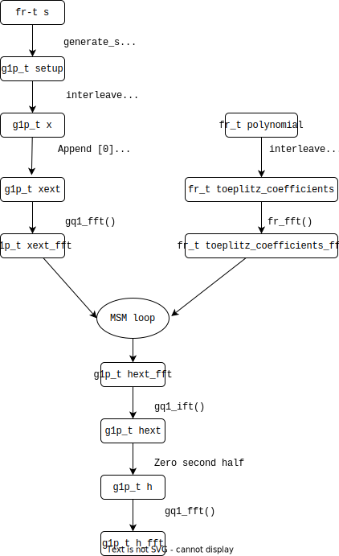

<!---
// bls12_381: Arithmetic for BLS12-381
// Copyright 2022-2023 Dag Arne Osvik
// Copyright 2022-2023 Luan Cardoso dos Santos
--->

FK20 for GPU
================================================================================
<!--- Introduction to fk20 here-->
This repository implements the "[Fast amortized KZG proofs](https://eprint.iacr.org/2023/033.pdf)", described by Dankrad Feist and Dmitry Khovratovich, which is a way of computing [KZG proofs](https://www.iacr.org/archive/asiacrypt2010/6477178/6477178.pdf) in superlinear time. This implementation leverages modern GPUs to parallelize the execution of (up to) 512 instances of FK20 with the same setup.

## Compilation

To download and compile the code and tests, run the following instructions:

```bash
$ git clone git@github.com:lCardosoSantos/FK20-CUDA.git
$ cd FK20-CUDA 
$ tar -xvzf test.tar.xz #precomputed KAT arrays ~3.5 GB uncompressed
$ make frtest fptest g1test fk20test fk20_512test fk20benchmark
```
_Note: test.tar.xz is tracked using git lfs_

The make targets are are as follows:

- `frtest` Compiles a test with the name `frtest`. This executable tests all the base arithmetic functions on the 256-bit residue used in BLS12-321 ($F_r$). These tests are run on the GPU. An optional command line parameter is used to set the level of testing:
  - `0` Executes only KAT and simple $FFT$ tests.
  - `1` Tests in `0`, and quick tests of basic functions
  - `2` Tests in `1`, and self-consistency tests of the commutative properties.
  - `3` Test in `2`, and self-consistency tests of associative and distributive properties.
- `fptest` Compiles a test with the same characterists as `frtest.`
- `g1test` Compiles a test for curve arithmetic, with the name `g1test`. This executable tests all the functions used to manipulate points in the curve defined over $F_p$, named $G_1$. These tests are run in the GPU, and the executable takes an integer $1 \leq i \leq 512$, which sets the number of CUDA blocks used in the test for $FFT$ and $FFT^{-1}$ functions. If the argument is `0`, $FFT$ testing will be skipped.
- `fk20test` Compiles a test for the FK20 functions and integration test. This executable also checks for false positives. Details on the individual tests are given in section [Testing](#Testing). 
- `fk20_512test` is similar to `fk20test`, but runs a test on many instances of FK20 running in multiple CUDA blocks.
- `fk20benchmark` Compiles a benchmark function on the subfunctions of FK20. The benchmark warms up the GPU first and then runs a series of tests before reporting the median of the measurements. 
  - Usage is `./fk20benchmark [-r rows] [-s NSAMPLES] [-h]` there `rows` is the number of FK20 rows and CUDA blocks, and `NSAMPLES` is the number of executions to be measured.

Additionally, `clean` and `shallowclean` are defined for cleaning the repository, with the latter being used to keep KAT objects.

### Prerequisites

<!--- Is there anything else to add here?--->
Requisites for compiling and running:
  - CUDA TOOLKIT $\geq$ 11.1 (earlier versions may also work).
  - GNU Make
  - git-lfs
  - GeFORCE RTX 30xx minimum.

## Testing

### Arithmetic library

Testing of the primitives in BLS12-381 is done in two main ways:
-  **KAT** Known Answer Test: Uses test vectors generated by reference code.
-  **Self consistency** The primitives are tested against themselves, using known mathematical relationships. For example, it is tested if $(FFT^{-n}(FFT^n(x))=x$, or  $x \circ y = y \circ x$ for an operation with commutative property. The tests are executed against a big number of variables in order to decrease the probability of a false-pass.

In the self consistency test for $F_r$ and $F_p$, the following properties are checked:


- Comparisons (given any x and y such that x != y):
  - $eq(x,x) \neq neq(x,x)$
  - $neq(x,x) = false$
  - $neq(x,y) = true$
  - $eq(x,x) = true$
  - $eq(x,y) = false$


- Multiplication by constant
  - $2(4x) = 8x$
  - $2(2(2(2(2(2x))))) = 4(4(4x)) = 8(8x)$
  - $3(4x) = 12(x)$
  - $3(3(3(2(4(8x))))) = 12(12(12x))$


- Addition and subtraction:
  - $2x + x = 3x$
  - $x+y = y+x$
  - $(x+y)+z = x+(y+z)$
  - $2x = 3x - x$


- Squaring:
  - $(x+n)^2 = x^2 + 2nx + n^2$
  - $(x+y)^2 = x^2 + 2xy + y^2$


- Multiplication:
  - $x \cdot y = y \cdot x$
  - $(x \cdot y) \cdot z = x \cdot (y \cdot z)$
  - $a(b+c) = ab+ac$
  - $(a+b)c = ac+bc$
  - $a(b-c) = ab-ac$
  - $(a-b)c = ac-bc$
  

- Modular inverse:
  - $x = x \cdot inv(x) \cdot x$

And for $F_r$, additionally $FFT^{-n}(FFT^n(x))=x$ is tested.

In $G1$, besides KAT, Fibonacci, and $FFT$ tests, the point-doubling function is tested as $p+p==dbl(p)$. 

### Test execution time

The time needed to perform the tests is given in the table below. Notice that full testing takes multiple hours. Tested on RTX3060.

| Test arg | `frtest` | `fptest` | `g1test` |
|----------|----------|----------|----------|
| 0        | 0.01s    | 0.5s     | 10.8s    |
| 1        | 2.4s     | 3.0s     | 22s      |
| 2        | 15s      | 9.3s     | -        |
| 3        | 2.6h     | 5.3h     | -        |
| 28       | -        | -        | 26s      |

For `fk20_512test`:

| Rows | Time  | SMs used |
|------|-------|----------|
| 1    | 14 s  | 3.6%     |
| 7    | 14 s  | 25%      |
| 14   | 15 s  | 50%      |
| 21   | 17 s  | 75%      |
| 28   | 19 s  | 100%     |
| 512  | 363 s | 18.3x    |

*SM = Streaming Multi processor.
### FK20

In FK20, the tests are divided into three groups:

- **FFT tests**: These tests check if $FFT$ and $FFT^{-1}$ transformations produce the expected results, compared to KATs from the reference python implementation.
- **Poly tests**: This groups the tests over functions that cover more than one step in a single CUDA kernel, as well as the main loop (MSM).
- **Full integration test**: This checks a full execution of the FK20 algorithm against the KAT.

All the tests in `fk20test` and `fk20_512test` implement a "memory pattern before execution" approach, which fills the device memory with a bit pattern, used to detect a fail-mode where an unwritten memory address happen to have the correct value in it from a previous execution. 

All the tests in `fk20test` and `fk20_512test` also introduce intentional errors and require test functions to detect these. This mitigates false positive results.

`fk20_512test` takes an integer between 1 and 512 as command line argument, and runs the tests from `fk20test`, with the argument being the number of rows. A row is defined as a different polynomial committed do the same setup. Each row is executed by one CUDA block with 256 threads. Single row and multi-row are in separated tests due to a single row fitting in a single CUDA block, making compilation and testing of `fk20test` more agile.

Additionally, each test displays a reference execution time. A more precise time measurement for each function is given by `fk20benchmark`.

Technical details on the test is given [here](./doc/fk20test.md)

### FK20 intermediate variables
<!--- put that nice fig here --->


The previous figure shows the execution flow of FK20, and the variable names. The setup is precomputed and stored in `xext_fft` which is then used on FK20 to transform the `polynomial` in the commitment `h_fft`.
### Naming conventions

Arithmetic functions are in the form `type_operation`, for example, addition in $F_p$ is `fp_add`. The prototype for those functions are in the header file `type.cuh`, and each function have doxygen comments with detailed information.

FK20 functions are named in the form `fk20_input2output` denoting a transformation from `input` to `output`. For example, the function that transforms from a polynomial into the commitment is `fk20_poly2h_fft`.

Test functions are in the format `Type`+`Test`+test name, for example, `FrTestAddSub` is a test for the `addsub` function in $F_r$.


<!----------------------------------------------------------------------------->
# References
<!--- bibliographic references for fk20-->
<!--- usefull links-->
[Function documentation and graphs](https://lcardososantos.github.io/FK20-CUDAdocs/files.html)

References and useful links:

- [Reference implementation in Python](https://github.com/ethereum/research/tree/master/kzg_data_availability)
- [FK20 whitepaper](https://eprint.iacr.org/2023/033.pdf)
- [KZG commitments paper in Asiacrypt](https://www.iacr.org/archive/asiacrypt2010/6477178/6477178.pdf)
- [KZG explanation by D.Feist](https://dankradfeist.de/ethereum/2020/06/16/kate-polynomial-commitments.html)
- [Primer on ECC Pairings](https://vitalik.ca/general/2017/01/14/exploring_ecp.html)
- [Primer on bls12-381](https://hackmd.io/@benjaminion/bls12-381)
  
